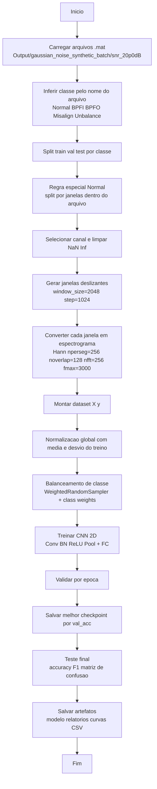

# Fluxograma - Treinamento da CNN (Espectrograma + Sliding Window)

## Observacoes
- Script principal de treino: `Code/train_cnn_spectrogram_fault_classifier.py`
- Modelo gerado: `Output/cnn_spectrogram_fault_classifier_balanced_v2/spectrogram_cnn_model.pt`
- Inferencia sliding window: `Code/infer_cnn_spectrogram_sliding.py`
